# Add data to categories
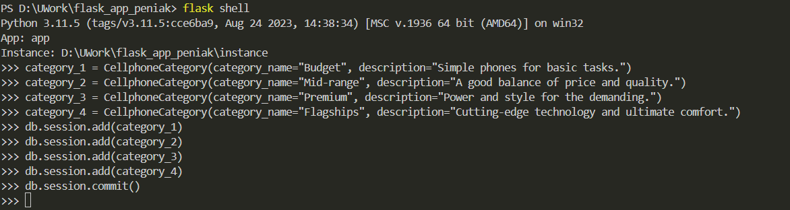
### Result of successful data adding
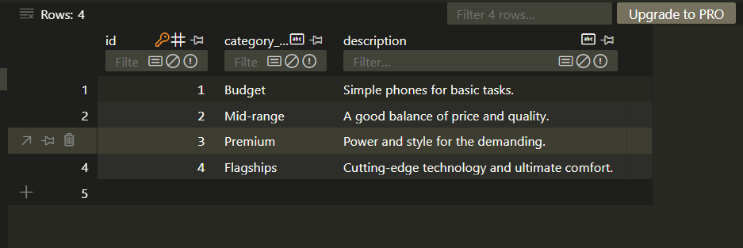
# Show all cellphones
### All cellphones. I made the output of all the cellphones like in the blueprint with the posts
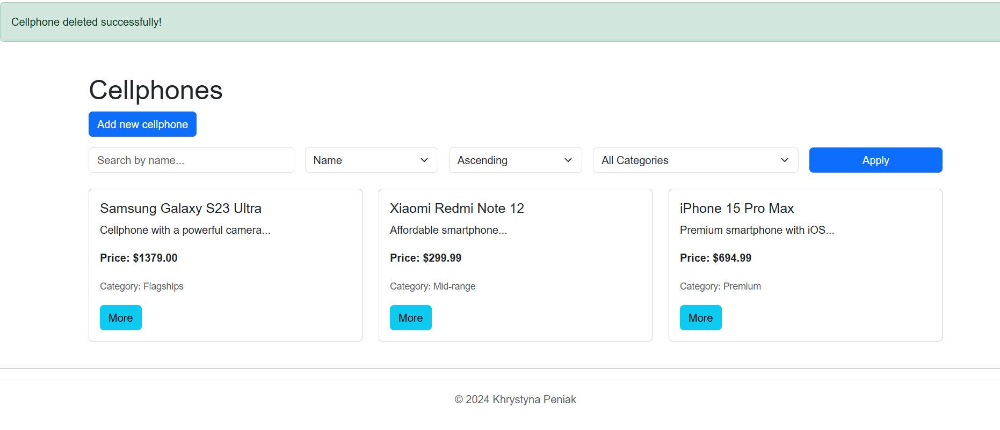
### Sort by price
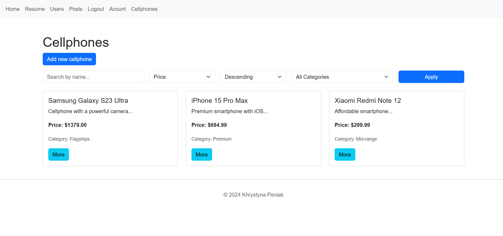
### User can change only his own cellphone. I loggin as user5
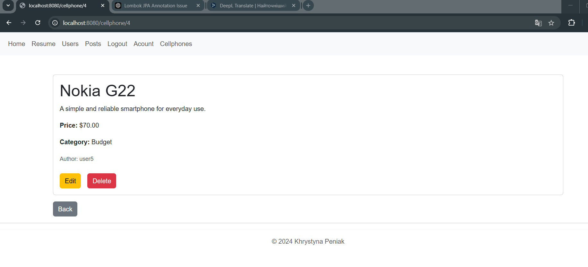
### User can not change other users cellphones

# Add cellphone operation
### Add cellphone
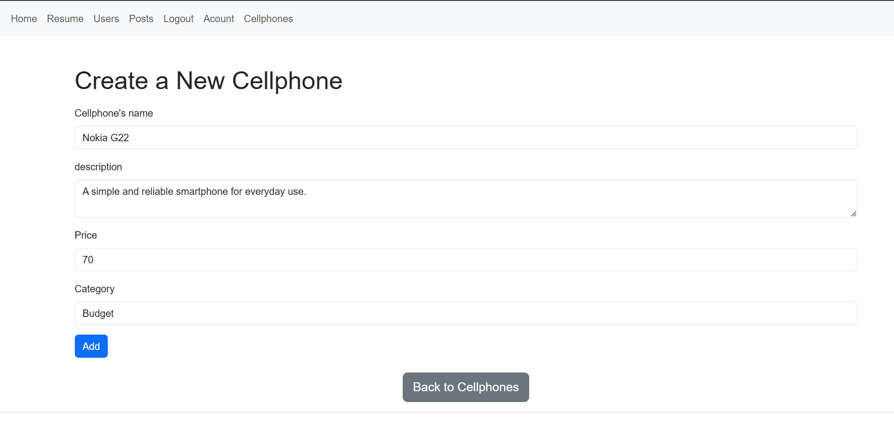
### Result
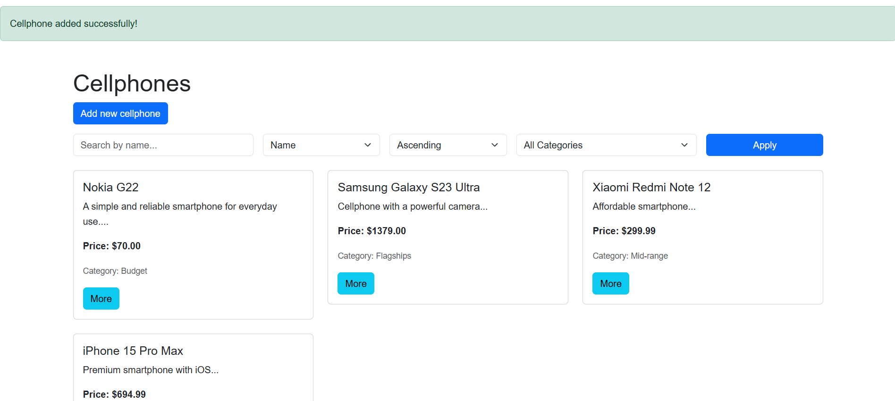
# Update cellphone operation
### Update cellphone
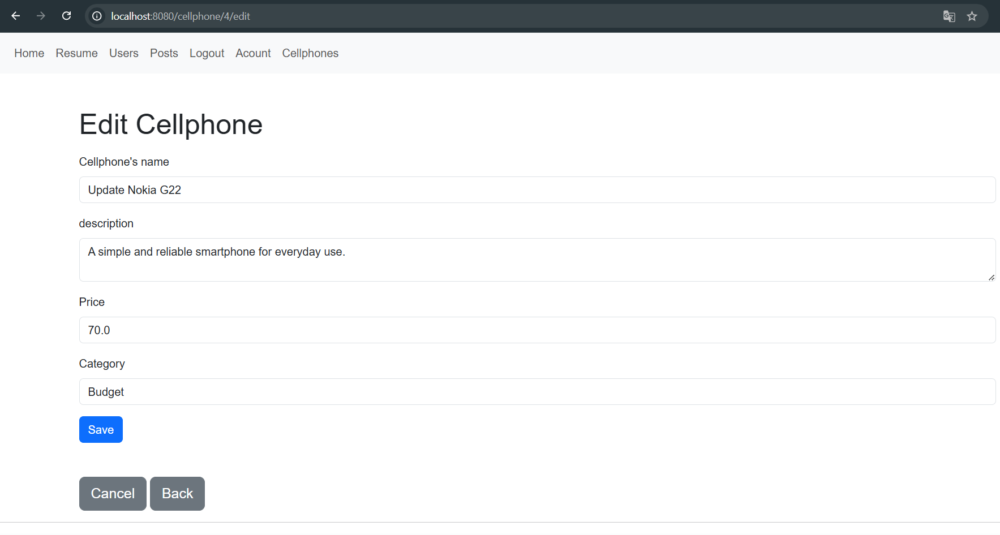
### Result
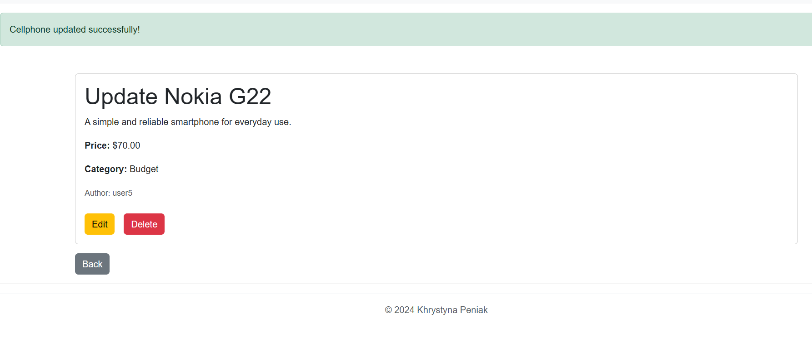
# Delete cellphone operation
### Delete cellphone
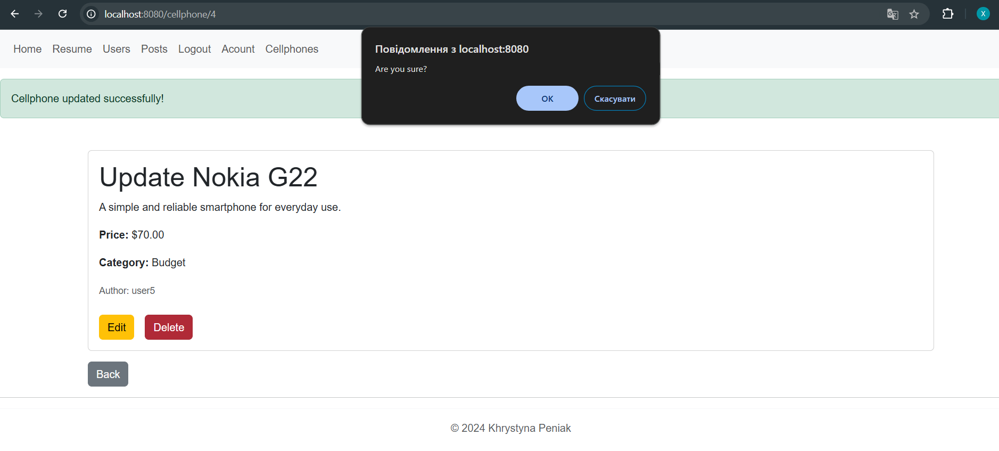
### Result
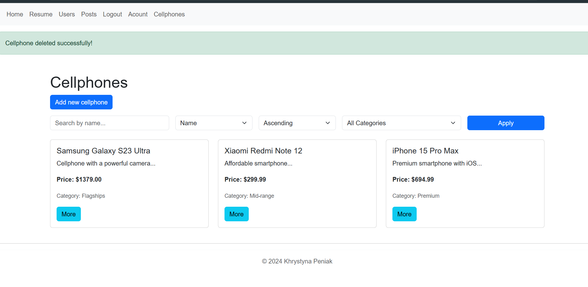